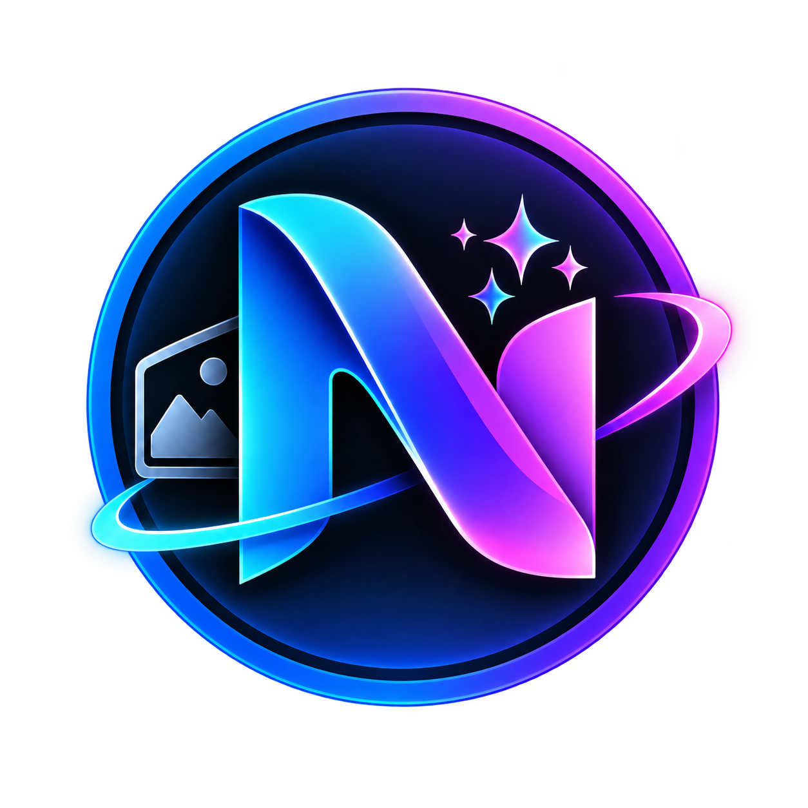

# Numera Image-Gen MCP

<div align="center">



[](https://github.com/KiaroSama/Numera-Image-Gen-MCP/actions/workflows/ci.yml)
[](LICENSE)
[](package.json)
[](tsconfig.json)
[](package.json)
[](docs/ARCHITECTURE.md)
[](docs/WINDOWS-WSL.md)
[](.github/workflows/ci.yml)
[](schemas/config.schema.json)
[](src/files/images.ts)
[](src/jobs/store.ts)
[](docs/CONFIGURATION.md)
[](package-lock.json)
[](#donate)

</div>

A local provider-independent image generation/editing MCP server. Keep your host chat model unchanged;
image work is an explicitly selected tool operation. Named connections, separate OmniRoute/9router
profiles, native image protocols and configured GPU ComfyUI workflows. No paid POST retries, hidden
uploads, prompt enhancement or automatic provider/model fallback.

**Status:** published offline-tested implementation;265 Windows tests and264 Linux tests pass
(one Windows-only DPAPI case skipped on Linux). Runtime coverage: at least89.55 percent statements
and87.97 percent branches.
See [test evidence](docs/TEST-RESULTS.md);
no npm publication, all-model support, GUI integration or production-readiness claim.

## Quick start

Node24.21.0/npm required; PowerShell7 recommended on Windows.

```powershell
npm ci
npm run build
```

Copy `examples/config.json` to `config.local.json`; adjust absolute roots and enable only intended
connections. Set each connection's declared secret source privately. Set absolute NUMERA_CONFIG.
Launch built `dist/index.js` with an absolute Node executable in your MCP client. Default stdio stdout
is exclusively protocol; logs go stderr/files. `npm run smoke` checks local handshake/tools/health
without contacting a provider. Setup: [scripts/setup.ps1](scripts/setup.ps1), `-WhatIf` supported.
Read-only connection readiness and real-test prerequisites: [Practical testing](docs/PRACTICAL-TESTING.md).
The readiness CLI never generates images; missing declared credentials fails with exit2.

## Protocols and tools

Generic Images, OmniRoute, 9router, Gemini generateContent, Gemini Interactions, OpenAI Responses image
tools, dedicated OpenRouter Images, opt-in chat image output and explicitly bound ComfyUI API graphs.
[Compatibility/limitations](docs/COMPATIBILITY.md) distinguish protocol evidence from account/model
availability. Antigravity refs are blocked at the examined gateway versions that drop input images.

10 tools: health_check, list_connections, list_models, get_model_capabilities, generate_image,
edit_image, get_job, cancel_job, list_outputs, get_output_info. Use one request_id per logical operation
and reuse it on host retries. Unknown outcomes never automatically resubmit. Native batches require
verified limits. Edit sources are typed output_id/path/url/data_url objects; no ambiguous strings.

Saved originals provide owned IDs, paths, actual MIME/dimensions/bytes/alpha/SHA256. Optional bounded
previews are derivatives. Local paths are not automatically accessible to cloud hosts. Prompts/input
bytes preserved; provider policy/terms still apply. Read [privacy](docs/PRIVACY.md).

## Documentation

[Configuration](docs/CONFIGURATION.md) · [OmniRoute](docs/OMNIROUTE.md) · [9router](docs/9ROUTER.md) ·
[Claude](docs/CLAUDE.md) · [Codex](docs/CODEX.md) · [Windows/WSL](docs/WINDOWS-WSL.md) ·
[Architecture](docs/ARCHITECTURE.md) · [Testing](docs/TESTING.md) · [Requirements](docs/REQUIREMENTS.md) ·
[References](docs/REFERENCES.md)

## Logs and troubleshooting

New UTF8 JSON log per execution: `numera-image-gen-mcp_YYYY-MM-DD_HH-mm-ss_UTC-<pid>-<uuid>.log`, UTC
ISO8601 timestamp, INFO/WARNING/ERROR/DEBUG and component. Default directory configured/per-user;
14-day own runtime-log retention, initialization falls back stderr. Prompts/keys/auth/cookies/Base64/
signed query data/original paths not logged. DEBUG never relaxes redaction. Attach only sanitized logs.

Catalog failure is not generation failure. Check route/base prefix/key/model before new authorization.
A text-only gateway cannot edit just because its model has native vision. Distinguish provider rejection,
partial stream, host timeout, OAuth/project/account problems, uncertain billing and storage permissions.
Never retry unknown generation automatically. Cancel waiting does not prove upstream cancellation/refund.

## License

[GPL-3.0-only](LICENSE), complete GPLv3 text. [Third-party notices](THIRD_PARTY_NOTICES.md).
Generated image/asset/model licensing is separate from software licensing.

## Donate

If this project helps you, donations are appreciated.

| Currency              | Network | Address                                            |
| --------------------- | ------- | -------------------------------------------------- |
| Bitcoin (BTC)         | Bitcoin | `bc1qmth5m03pu5hujw5xw5jmywam3jj3sqwqupesdt`       |
| USDT, BNB, USDC, etc. | BEP20   | `0x0Bd0BA443a8B9cf15922bf7f0Bb0a4b495fD06Ef`       |
| USDT, TRX, USDC, etc. | TRC20   | `TWBA3xFTqgZAeAYMxqo85xWnzvty3DcAhw`               |
| Ethereum (ETH)        | ERC20   | `0x0Bd0BA443a8B9cf15922bf7f0Bb0a4b495fD06Ef`       |
| TON                   | TON     | `UQCN8Umo_OfOWqImZetQsrNStPcmLkMAKajFyiCOhso23NDb` |
| Litecoin (LTC)        | LTC     | `ltc1qntqnnrunadurnw4cshv3qgspywrueyyeyngwuy`      |
| Solana (SOL)          | Solana  | `7B2wkczUjmkDhETwQuknBL8sUsbuV7nErxc317TmQuwR`     |
| Polygon (POL)         | Polygon | `0x0Bd0BA443a8B9cf15922bf7f0Bb0a4b495fD06Ef`       |
